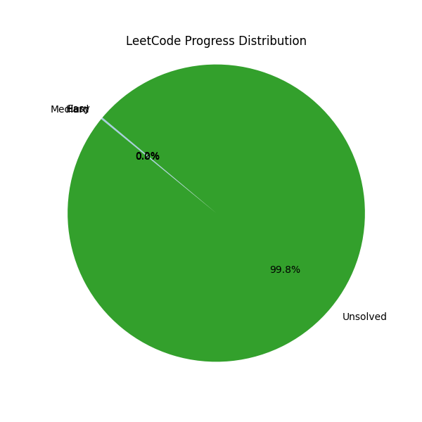

### 📊 LeetCode Progress Stats

# Leetcode Task List

### Easy

| Task                                                                                                                                           | Done |
| ---------------------------------------------------------------------------------------------------------------------------------------------- | ---- |
| [Two Sum](https://leetcode.com/problems/two-sum)                                                                                               | [X]  |
| [Compare Strings by Frequency of the Smallest Character](https://leetcode.com/problems/compare-strings-by-frequency-of-the-smallest-character) | [ ]  |
| [Logger Rate Limiter](https://leetcode.com/problems/logger-rate-limiter)                                                                       | [ ]  |
| [Bulls and Cows](https://leetcode.com/problems/bulls-and-cows)                                                                                 | [ ]  |
| [Backspace String Compare](https://leetcode.com/problems/backspace-string-compare)                                                             | [ ]  |
| [License Key Formatting](https://leetcode.com/problems/license-key-formatting)                                                                 | [ ]  |
| [Moving Average from Data Stream](https://leetcode.com/problems/moving-average-from-data-stream)                                               | [ ]  |
| [X of a Kind in a Deck of Cards](https://leetcode.com/problems/x-of-a-kind-in-a-deck-of-cards)                                                 | [ ]  |
| [Maximum Subarray](https://leetcode.com/problems/maximum-subarray)                                                                             | [ ]  |
| [Repeated Substring Pattern](https://leetcode.com/problems/repeated-substring-pattern)                                                         | [ ]  |
| [Isomorphic Strings](https://leetcode.com/problems/isomorphic-strings)                                                                         | [ ]  |
| [Confusing Number](https://leetcode.com/problems/confusing-number)                                                                             | [ ]  |
| [Student Attendance Record I](https://leetcode.com/problems/student-attendance-record-i)                                                       | [ ]  |
| [Design Compressed String Iterator](https://leetcode.com/problems/design-compressed-string-iterator)                                           | [ ]  |
| [House Robber](https://leetcode.com/problems/house-robber)                                                                                     | [ ]  |
| [Magic Squares In Grid](https://leetcode.com/problems/magic-squares-in-grid)                                                                   | [ ]  |
| [Longest Word in Dictionary](https://leetcode.com/problems/longest-word-in-dictionary)                                                         | [ ]  |
| [Single-Row Keyboard](https://leetcode.com/problems/single-row-keyboard)                                                                       | [ ]  |
| [Paint Fence](https://leetcode.com/problems/paint-fence)                                                                                       | [ ]  |
| [Employee Importance](https://leetcode.com/problems/employee-importance)                                                                       | [ ]  |
| [Plus One](https://leetcode.com/problems/plus-one)                                                                                             | [ ]  |
| [Long Pressed Name](https://leetcode.com/problems/long-pressed-name)                                                                           | [ ]  |
| [Strobogrammatic Number](https://leetcode.com/problems/strobogrammatic-number)                                                                 | [ ]  |
| [Sentence Similarity](https://leetcode.com/problems/sentence-similarity)                                                                       | [ ]  |
| [Invert Binary Tree](https://leetcode.com/problems/invert-binary-tree)                                                                         | [ ]  |
| [Is Subsequence](https://leetcode.com/problems/is-subsequence)                                                                                 | [ ]  |
| [Shortest Distance to a Character](https://leetcode.com/problems/shortest-distance-to-a-character)                                             | [ ]  |
| [Repeated String Match](https://leetcode.com/problems/repeated-string-match)                                                                   | [ ]  |
| [Merge Two Sorted Lists](https://leetcode.com/problems/merge-two-sorted-lists)                                                                 | [ ]  |
| [Positions of Large Groups](https://leetcode.com/problems/positions-of-large-groups)                                                           | [ ]  |
| [Peak Index in a Mountain Array](https://leetcode.com/problems/peak-index-in-a-mountain-array)                                                 | [ ]  |
| [Find Positive Integer Solution for a Given Equation](https://leetcode.com/problems/find-positive-integer-solution-for-a-given-equation)       | [ ]  |
| [Design HashSet](https://leetcode.com/problems/design-hashset)                                                                                 | [ ]  |
| [Design HashMap](https://leetcode.com/problems/design-hashmap)                                                                                 | [ ]  |
| [Excel Sheet Column Title](https://leetcode.com/problems/excel-sheet-column-title)                                                             | [ ]  |
| [Valid Parentheses](https://leetcode.com/problems/valid-parentheses)                                                                           | [ ]  |
| [Remove Outermost Parentheses](https://leetcode.com/problems/remove-outermost-parentheses)                                                     | [ ]  |
| [Two City Scheduling](https://leetcode.com/problems/two-city-scheduling)                                                                       | [ ]  |
| [Diameter of Binary Tree](https://leetcode.com/problems/diameter-of-binary-tree)                                                               | [ ]  |
| [Heaters](https://leetcode.com/problems/heaters)                                                                                               | [ ]  |
| [Happy Number](https://leetcode.com/problems/happy-number)                                                                                     | [ ]  |
| [Rectangle Overlap](https://leetcode.com/problems/rectangle-overlap)                                                                           | [ ]  |
| [Longest Common Prefix](https://leetcode.com/problems/longest-common-prefix)                                                                   | [ ]  |
| [Remove All Adjacent Duplicates In String](https://leetcode.com/problems/remove-all-adjacent-duplicates-in-string)                             | [ ]  |
| [Contains Duplicate II](https://leetcode.com/problems/contains-duplicate-ii)                                                                   | [ ]  |
| [Largest Time for Given Digits](https://leetcode.com/problems/largest-time-for-given-digits)                                                   | [ ]  |
| [Palindrome Number](https://leetcode.com/problems/palindrome-number)                                                                           | [ ]  |
| [Flood Fill](https://leetcode.com/problems/flood-fill)                                                                                         | [ ]  |
| [Relative Sort Array](https://leetcode.com/problems/relative-sort-array)                                                                       | [ ]  |
| [Balanced Binary Tree](https://leetcode.com/problems/balanced-binary-tree)                                                                     | [ ]  |
| [Best Time to Buy and Sell Stock](https://leetcode.com/problems/best-time-to-buy-and-sell-stock)                                               | [ ]  |
| [Majority Element](https://leetcode.com/problems/majority-element)                                                                             | [ ]  |
| [Shortest Word Distance](https://leetcode.com/problems/shortest-word-distance)                                                                 | [ ]  |
| [Baseball Game](https://leetcode.com/problems/baseball-game)                                                                                   | [ ]  |
| [Find the Difference](https://leetcode.com/problems/find-the-difference)                                                                       | [ ]  |
| [Reverse Linked List](https://leetcode.com/problems/reverse-linked-list)                                                                       | [ ]  |
| [Add to Array-Form of Integer](https://leetcode.com/problems/add-to-array-form-of-integer)                                                     | [ ]  |
| [String Compression](https://leetcode.com/problems/string-compression)                                                                         | [ ]  |
| [Count and Say](https://leetcode.com/problems/count-and-say)                                                                                   | [ ]  |
| [Find Pivot Index](https://leetcode.com/problems/find-pivot-index)                                                                             | [ ]  |
| [Reformat Department Table](https://leetcode.com/problems/reformat-department-table)                                                           | [ ]  |
| [Read N Characters Given Read4](https://leetcode.com/problems/read-n-characters-given-read4)                                                   | [ ]  |
| [Non-decreasing Array](https://leetcode.com/problems/non-decreasing-array)                                                                     | [ ]  |
| [Pascal's Triangle](https://leetcode.com/problems/pascals-triangle)                                                                            | [ ]  |
| [Move Zeroes](https://leetcode.com/problems/move-zeroes)                                                                                       | [ ]  |
| [Maximize Distance to Closest Person](https://leetcode.com/problems/maximize-distance-to-closest-person)                                       | [ ]  |
| [Valid Mountain Array](https://leetcode.com/problems/valid-mountain-array)                                                                     | [ ]  |
| [Longest Palindrome](https://leetcode.com/problems/longest-palindrome)                                                                         | [ ]  |
| [Maximum Depth of Binary Tree](https://leetcode.com/problems/maximum-depth-of-binary-tree)                                                     | [ ]  |
| [Island Perimeter](https://leetcode.com/problems/island-perimeter)                                                                             | [ ]  |
| [Longest Univalue Path](https://leetcode.com/problems/longest-univalue-path)                                                                   | [ ]  |
| [Meeting Rooms](https://leetcode.com/problems/meeting-rooms)                                                                                   | [ ]  |
| [Toeplitz Matrix](https://leetcode.com/problems/toeplitz-matrix)                                                                               | [ ]  |
| [First Bad Version](https://leetcode.com/problems/first-bad-version)                                                                           | [ ]  |
| [Trim a Binary Search Tree](https://leetcode.com/problems/trim-a-binary-search-tree)                                                           | [ ]  |
| [Merge Sorted Array](https://leetcode.com/problems/merge-sorted-array)                                                                         | [ ]  |
| [Single Number](https://leetcode.com/problems/single-number)                                                                                   | [ ]  |
| [Valid Anagram](https://leetcode.com/problems/valid-anagram)                                                                                   | [ ]  |
| [Intersection of Two Arrays](https://leetcode.com/problems/intersection-of-two-arrays)                                                         | [ ]  |
| [Guess Number Higher or Lower](https://leetcode.com/problems/guess-number-higher-or-lower)                                                     | [ ]  |
| [Divisor Game](https://leetcode.com/problems/divisor-game)                                                                                     | [ ]  |
| [Climbing Stairs](https://leetcode.com/problems/climbing-stairs)                                                                               | [ ]  |
| [Best Time to Buy and Sell Stock II](https://leetcode.com/problems/best-time-to-buy-and-sell-stock-ii)                                         | [ ]  |
| [Range Sum Query - Immutable](https://leetcode.com/problems/range-sum-query-immutable)                                                         | [ ]  |
| [Next Greater Element I](https://leetcode.com/problems/next-greater-element-i)                                                                 | [ ]  |
| [Reverse String](https://leetcode.com/problems/reverse-string)                                                                                 | [ ]  |
| [Employees Earning More Than Their Managers](https://leetcode.com/problems/employees-earning-more-than-their-managers)                         | [ ]  |
| [Decompress Run-Length Encoded List](https://leetcode.com/problems/decompress-run-length-encoded-list)                                         | [ ]  |
| [Reverse Integer](https://leetcode.com/problems/reverse-integer)                                                                               | [ ]  |
| [Delete Node in a Linked List](https://leetcode.com/problems/delete-node-in-a-linked-list)                                                     | [ ]  |
| [Height Checker](https://leetcode.com/problems/height-checker)                                                                                 | [ ]  |
| [Sqrt(x)](https://leetcode.com/problems/sqrtx)                                                                                                 | [ ]  |
| [Excel Sheet Column Number](https://leetcode.com/problems/excel-sheet-column-number)                                                           | [ ]  |
| [Intersection of Two Linked Lists](https://leetcode.com/problems/intersection-of-two-linked-lists)                                             | [ ]  |
| [Maximum Depth of N-ary Tree](https://leetcode.com/problems/maximum-depth-of-n-ary-tree)                                                       | [ ]  |
| [Subtract the Product and Sum of Digits of an Integer](https://leetcode.com/problems/subtract-the-product-and-sum-of-digits-of-an-integer)     | [ ]  |
| [Min Stack](https://leetcode.com/problems/min-stack)                                                                                           | [ ]  |
| [Binary Tree Paths](https://leetcode.com/problems/binary-tree-paths)                                                                           | [ ]  |
| [Subtree of Another Tree](https://leetcode.com/problems/subtree-of-another-tree)                                                               | [ ]  |
| [Add Binary](https://leetcode.com/problems/add-binary)                                                                                         | [ ]  |
| [Power of Two](https://leetcode.com/problems/power-of-two)                                                                                     | [ ]  |
| [First Unique Character in a String](https://leetcode.com/problems/first-unique-character-in-a-string)                                         | [ ]  |
| [Roman to Integer](https://leetcode.com/problems/roman-to-integer)                                                                             | [ ]  |
| [Symmetric Tree](https://leetcode.com/problems/symmetric-tree)                                                                                 | [ ]  |
| [Fizz Buzz](https://leetcode.com/problems/fizz-buzz)                                                                                           | [ ]  |
| [Number of Steps to Reduce a Number to Zero](https://leetcode.com/problems/number-of-steps-to-reduce-a-number-to-zero)                         | [ ]  |
| [Two Sum II - Input array is sorted](https://leetcode.com/problems/two-sum-ii-input-array-is-sorted)                                           | [ ]  |
| [Max Consecutive Ones](https://leetcode.com/problems/max-consecutive-ones)                                                                     | [ ]  |
| [Search Insert Position](https://leetcode.com/problems/search-insert-position)                                                                 | [ ]  |
| [Reverse Bits](https://leetcode.com/problems/reverse-bits)                                                                                     | [ ]  |
| [Valid Palindrome](https://leetcode.com/problems/valid-palindrome)                                                                             | [ ]  |
| [Implement strStr()](https:)                                                                                                                   | [ ]  |

### Medium

| Task                                                                                                                                                                                   | Done |
| -------------------------------------------------------------------------------------------------------------------------------------------------------------------------------------- | ---- |
| [Minimum Domino Rotations For Equal Row](https://leetcode.com/problems/minimum-domino-rotations-for-equal-row)                                                                         | [ ]  |
| [Expressive Words](https://leetcode.com/problems/expressive-words)                                                                                                                     | [ ]  |
| [Delete Nodes And Return Forest](https://leetcode.com/problems/delete-nodes-and-return-forest)                                                                                         | [ ]  |
| [Split Array into Consecutive Subsequences](https://leetcode.com/problems/split-array-into-consecutive-subsequences)                                                                   | [ ]  |
| [Shortest Way to Form String](https://leetcode.com/problems/shortest-way-to-form-string)                                                                                               | [ ]  |
| [Validate Stack Sequences](https://leetcode.com/problems/validate-stack-sequences)                                                                                                     | [ ]  |
| [Hand of Straights](https://leetcode.com/problems/hand-of-straights)                                                                                                                   | [ ]  |
| [Longest Continuous Subarray With Absolute Diff Less Than or Equal to Limit](https://leetcode.com/problems/longest-continuous-subarray-with-absolute-diff-less-than-or-equal-to-limit) | [ ]  |
| [Open the Lock](https://leetcode.com/problems/open-the-lock)                                                                                                                           | [ ]  |
| [Campus Bikes](https://leetcode.com/problems/campus-bikes)                                                                                                                             | [ ]  |
| [Count Complete Tree Nodes](https://leetcode.com/problems/count-complete-tree-nodes)                                                                                                   | [ ]  |
| [Flip Equivalent Binary Trees](https://leetcode.com/problems/flip-equivalent-binary-trees)                                                                                             | [ ]  |
| [Snapshot Array](https://leetcode.com/problems/snapshot-array)                                                                                                                         | [ ]  |
| [Minimum Swaps To Make Sequences Increasing](https://leetcode.com/problems/minimum-swaps-to-make-sequences-increasing)                                                                 | [ ]  |
| [Image Overlap](https://leetcode.com/problems/image-overlap)                                                                                                                           | [ ]  |
| [Find And Replace in String](https://leetcode.com/problems/find-and-replace-in-string)                                                                                                 | [ ]  |
| [Longest Line of Consecutive One in Matrix](https://leetcode.com/problems/longest-line-of-consecutive-one-in-matrix)                                                                   | [ ]  |
| [Encode and Decode Strings](https://leetcode.com/problems/encode-and-decode-strings)                                                                                                   | [ ]  |
| [Minimum Area Rectangle](https://leetcode.com/problems/minimum-area-rectangle)                                                                                                         | [ ]  |
| [Maximum Points You Can Obtain from Cards](https://leetcode.com/problems/maximum-points-you-can-obtain-from-cards)                                                                     | [ ]  |
| [Longest String Chain](https://leetcode.com/problems/longest-string-chain)                                                                                                             | [ ]  |
| [Sequence Reconstruction](https://leetcode.com/problems/sequence-reconstruction)                                                                                                       | [ ]  |
| [Maximal Square](https://leetcode.com/problems/maximal-square)                                                                                                                         | [ ]  |
| [My Calendar I](https://leetcode.com/problems/my-calendar-i)                                                                                                                           | [ ]  |
| [Candy Crush](https://leetcode.com/problems/candy-crush)                                                                                                                               | [ ]  |
| [Random Pick with Weight](https://leetcode.com/problems/random-pick-with-weight)                                                                                                       | [ ]  |
| [Divide Array in Sets of K Consecutive Numbers](https://leetcode.com/problems/divide-array-in-sets-of-k-consecutive-numbers)                                                           | [ ]  |
| [Remove Comments](https://leetcode.com/problems/remove-comments)                                                                                                                       | [ ]  |
| [Design Hit Counter](https://leetcode.com/problems/design-hit-counter)                                                                                                                 | [ ]  |
| [Maximum Sum of Two Non-Overlapping Subarrays](https://leetcode.com/problems/maximum-sum-of-two-non-overlapping-subarrays)                                                             | [ ]  |
| [Capacity To Ship Packages Within D Days](https://leetcode.com/problems/capacity-to-ship-packages-within-d-days)                                                                       | [ ]  |
| [Minimum Knight Moves](https://leetcode.com/problems/minimum-knight-moves)                                                                                                             | [ ]  |
| [Decode String](https://leetcode.com/problems/decode-string)                                                                                                                           | [ ]  |
| [Evaluate Division](https://leetcode.com/problems/evaluate-division)                                                                                                                   | [ ]  |
| [Swap Adjacent in LR String](https://leetcode.com/problems/swap-adjacent-in-lr-string)                                                                                                 | [ ]  |
| [Find Two Non-overlapping Sub-arrays Each With Target Sum](https://leetcode.com/problems/find-two-non-overlapping-sub-arrays-each-with-target-sum)                                     | [ ]  |
| [Missing Element in Sorted Array](https://leetcode.com/problems/missing-element-in-sorted-array)                                                                                       | [ ]  |
| [Time Needed to Inform All Employees](https://leetcode.com/problems/time-needed-to-inform-all-employees)                                                                               | [ ]  |
| [New 21 Game](https://leetcode.com/problems/new-21-game)                                                                                                                               | [ ]  |
| [Network Delay Time](https://leetcode.com/problems/network-delay-time)                                                                                                                 | [ ]  |
| [Number of Matching Subsequences](https://leetcode.com/problems/number-of-matching-subsequences)                                                                                       | [ ]  |
| [Maximum Side Length of a Square with Sum Less than or Equal to Threshold](https://leetcode.com/problems/maximum-side-length-of-a-square-with-sum-less-than-or-equal-to-threshold)     | [ ]  |
| [Binary Tree Coloring Game](https://leetcode.com/problems/binary-tree-coloring-game)                                                                                                   | [ ]  |
| [Valid Square](https://leetcode.com/problems/valid-square)                                                                                                                             | [ ]  |
| [Binary Tree Longest Consecutive Sequence](https://leetcode.com/problems/binary-tree-longest-consecutive-sequence)                                                                     | [ ]  |
| [Reorganize String](https://leetcode.com/problems/reorganize-string)                                                                                                                   | [ ]  |
| [House Robber III](https://leetcode.com/problems/house-robber-iii)                                                                                                                     | [ ]  |
| [Path with Maximum Gold](https://leetcode.com/problems/path-with-maximum-gold)                                                                                                         | [ ]  |
| [Find Duplicate Subtrees](https://leetcode.com/problems/find-duplicate-subtrees)                                                                                                       | [ ]  |
| [Brace Expansion](https://leetcode.com/problems/brace-expansion)                                                                                                                       | [ ]  |
| [Subarray Sum Equals K](https://leetcode.com/problems/subarray-sum-equals-k)                                                                                                           | [ ]  |
| [Next Closest Time](https://leetcode.com/problems/next-closest-time)                                                                                                                   | [ ]  |
| [Meeting Rooms II](https://leetcode.com/problems/meeting-rooms-ii)                                                                                                                     | [ ]  |
| [Construct Binary Tree from Preorder and Postorder Traversal](https://leetcode.com/problems/construct-binary-tree-from-preorder-and-postorder-traversal)                               | [ ]  |
| [Flatten a Multilevel Doubly Linked List](https://leetcode.com/problems/flatten-a-multilevel-doubly-linked-list)                                                                       | [ ]  |
| [Dice Roll Simulation](https://leetcode.com/problems/dice-roll-simulation)                                                                                                             | [ ]  |
| [My Calendar II](https://leetcode.com/problems/my-calendar-ii)                                                                                                                         | [ ]  |
| [Count Square Submatrices with All Ones](https://leetcode.com/problems/count-square-submatrices-with-all-ones)                                                                         | [ ]  |
| [RLE Iterator](https://leetcode.com/problems/rle-iterator)                                                                                                                             | [ ]  |
| [Most Stones Removed with Same Row or Column](https://leetcode.com/problems/most-stones-removed-with-same-row-or-column)                                                               | [ ]  |
| [Time Based Key-Value Store](https://leetcode.com/problems/time-based-key-value-store)                                                                                                 | [ ]  |
| [Minimum Size Subarray Sum](https://leetcode.com/problems/minimum-size-subarray-sum)                                                                                                   | [ ]  |
| [Merge Intervals](https://leetcode.com/problems/merge-intervals)                                                                                                                       | [ ]  |
| [Sentence Similarity II](https://leetcode.com/problems/sentence-similarity-ii)                                                                                                         | [ ]  |
| [Guess Number Higher or Lower II](https://leetcode.com/problems/guess-number-higher-or-lower-ii)                                                                                       | [ ]  |
| [Add Two Numbers](https://leetcode.com/problems/add-two-numbers)                                                                                                                       | [ ]  |
| [Number of Islands](https://leetcode.com/problems/number-of-islands)                                                                                                                   | [ ]  |
| [Stone Game II](https://leetcode.com/problems/stone-game-ii)                                                                                                                           | [ ]  |
| [Longest Mountain in Array](https://leetcode.com/problems/longest-mountain-in-array)                                                                                                   | [ ]  |
| [Print Immutable Linked List in Reverse](https://leetcode.com/problems/print-immutable-linked-list-in-reverse)                                                                         | [ ]  |
| [Word Ladder](https://leetcode.com/problems/word-ladder)                                                                                                                               | [ ]  |
| [Maximum Size Subarray Sum Equals k](https://leetcode.com/problems/maximum-size-subarray-sum-equals-k)                                                                                 | [ ]  |
| [Campus Bikes II](https://leetcode.com/problems/campus-bikes-ii)                                                                                                                       | [ ]  |
| [Car Fleet](https://leetcode.com/problems/car-fleet)                                                                                                                                   | [ ]  |
| [Binary Search Tree Iterator](https://leetcode.com/problems/binary-search-tree-iterator)                                                                                               | [ ]  |
| [Plus One Linked List](https://leetcode.com/problems/plus-one-linked-list)                                                                                                             | [ ]  |
| [Design Snake Game](https://leetcode.com/problems/design-snake-game)                                                                                                                   | [ ]  |
| [Palindrome Permutation II](https://leetcode.com/problems/palindrome-permutation-ii)                                                                                                   | [ ]  |
| [UTF-8 Validation](https://leetcode.com/problems/utf-8-validation)                                                                                                                     | [ ]  |
| [Pacific Atlantic Water Flow](https://leetcode.com/problems/pacific-atlantic-water-flow)                                                                                               | [ ]  |
| [Product of the Last K Numbers](https://leetcode.com/problems/product-of-the-last-k-numbers)                                                                                           | [ ]  |
| [Reveal Cards In Increasing Order](https://leetcode.com/problems/reveal-cards-in-increasing-order)                                                                                     | [ ]  |
| [Implement Trie (Prefix Tree)](https://leetcode.com/problems/implement-trie-prefix-tree)                                                                                               | [ ]  |
| [LRU Cache](https://leetcode.com/problems/lru-cache)                                                                                                                                   | [ ]  |
| [Range Sum Query 2D - Immutable](https://leetcode.com/problems/range-sum-query-2d-immutable)                                                                                           | [ ]  |
| [Reconstruct Itinerary](https://leetcode.com/problems/reconstruct-itinerary)                                                                                                           | [ ]  |
| [Generalized Abbreviation](https://leetcode.com/problems/generalized-abbreviation)                                                                                                     | [ ]  |
| [Linked List Components](https://leetcode.com/problems/linked-list-components)                                                                                                         | [ ]  |
| [Longest Repeating Substring](https://leetcode.com/problems/longest-repeating-substring)                                                                                               | [ ]  |
| [All Possible Full Binary Trees](https://leetcode.com/problems/all-possible-full-binary-trees)                                                                                         | [ ]  |
| [H-Index](https://leetcode.com/problems/h-index)                                                                                                                                       | [ ]  |
| [Sentence Screen Fitting](https://leetcode.com/problems/sentence-screen-fitting)                                                                                                       | [ ]  |
| [Maximum of Absolute Value Expression](https://leetcode.com/problems/maximum-of-absolute-value-expression)                                                                             | [ ]  |
| [Insert into a Sorted Circular Linked List](https://leetcode.com/problems/insert-into-a-sorted-circular-linked-list)                                                                   | [ ]  |
| [Binary Tree Longest Consecutive Sequence II](https://leetcode.com/problems/binary-tree-longest-consecutive-sequence-ii)                                                               | [ ]  |
| [Reorder Routes to Make All Paths Lead to the City Zero](https://leetcode.com/problems/reorder-routes-to-make-all-paths-lead-to-the-city-zero)                                         | [ ]  |
| [Insert Delete GetRandom O(1)](https://leetcode.com/problems/insert-delete-getrandom-o1)                                                                                               | [ ]  |
| [Missing Ranges](https://leetcode.com/problems/missing-ranges)                                                                                                                         | [ ]  |
| [Strobogrammatic Number II](https://leetcode.com/problems/strobogrammatic-number-ii)                                                                                                   | [ ]  |
| [Interval List Intersections](https://leetcode.com/problems/interval-list-intersections)                                                                                               | [ ]  |
| [Online Election](https://leetcode.com/problems/online-election)                                                                                                                       | [ ]  |
| [Letter Combinations of a Phone Number](https://leetcode.com/problems/letter-combinations-of-a-phone-number)                                                                           | [ ]  |
| [Longest Repeating Character Replacement](https://leetcode.com/problems/longest-repeating-character-replacement)                                                                       | [ ]  |
| [Multiply Strings](https://leetcode.com/problems/multiply-strings)                                                                                                                     | [ ]  |
| [Fraction to Recurring Decimal](https://leetcode.com/problems/fraction-to-recurring-decimal)                                                                                           | [ ]  |
| [Knight Dialer](https://leetcode.com/problems/knight-dialer)                                                                                                                           | [ ]  |
| [Minimum Area Rectangle II](https://leetcode.com/problems/minimum-area-rectangle-ii)                                                                                                   | [ ]  |
| [Find First and Last Position of Element in Sorted Array](https://leetcode.com/problems/find-first-and-last-position-of-element-in-sorted-array)                                       | [ ]  |
| [3Sum](https://leetcode.com/problems/3sum)                                                                                                                                             | [ ]  |
| [Number of Dice Rolls With Target Sum](https://leetcode.com/problems/number-of-dice-rolls-with-target-sum)                                                                             | [ ]  |
| [Longest Substring Without Repeating Characters](https://leetcode.com/problems/longest-substring-without-repeating-characters)                                                         | [ ]  |
| [Accounts Merge](https://leetcode.com/problems/accounts-merge)                                                                                                                         | [ ]  |
| [Android Unlock Patterns](https://leetcode.com/problems/android-unlock-patterns)                                                                                                       | [ ]  |
| [Unique Word Abbreviation](https://leetcode.com/problems/unique-word-abbreviation)                                                                                                     | [ ]  |
| [Sort Transformed Array](https://leetcode.com/problems/sort-transformed-array)                                                                                                         | [ ]  |
| [Find Eventual Safe States](https://leetcode.com/problems/find-eventual-safe-states)                                                                                                   | [ ]  |
| [Path With Maximum Minimum Value](https://leetcode.com/problems/path-with-maximum-minimum-value)                                                                                       | [ ]  |
| [Top K Frequent Words](https://leetcode.com/problems/top-k-frequent-words)                                                                                                             | [ ]  |
| [Next Permutation](https://leetcode.com/problems/next-permutation)                                                                                                                     | [ ]  |
| [Decode Ways](https://leetcode.com/problems/decode-ways)                                                                                                                               | [ ]  |
| [Unique Binary Search Trees](https://leetcode.com/problems/unique-binary-search-trees)                                                                                                 | [ ]  |
| [Perfect Squares](https://leetcode.com/problems/perfect-squares)                                                                                                                       | [ ]  |
| [Exam Room](https://leetcode.com/problems/exam-room)                                                                                                                                   | [ ]  |
| [Search in a Sorted Array of Unknown Size](https://leetcode.com/problems/search-in-a-sorted-array-of-unknown-size)                                                                     | [ ]  |
| [Count Univalue Subtrees](https://leetcode.com/problems/count-univalue-subtrees)                                                                                                       | [ ]  |
| [Walls and Gates](https://leetcode.com/problems/walls-and-gates)                                                                                                                       | [ ]  |
| [Remove All Adjacent Duplicates in String II](https://leetcode.com/problems/remove-all-adjacent-duplicates-in-string-ii)                                                               | [ ]  |
| [Range Sum Query - Mutable](https://leetcode.com/problems/range-sum-query-mutable)                                                                                                     | [ ]  |
| [Word Break](https://leetcode.com/problems/word-break)                                                                                                                                 | [ ]  |
| [Bomb Enemy](https://leetcode.com/problems/bomb-enemy)                                                                                                                                 | [ ]  |
| [Longest Arithmetic Subsequence of Given Difference](https://leetcode.com/problems/longest-arithmetic-subsequence-of-given-difference)                                                 | [ ]  |
| [Summary Ranges](https://leetcode.com/problems/summary-ranges)                                                                                                                         | [ ]  |
| [Count Submatrices With All Ones](https://leetcode.com/problems/count-submatrices-with-all-ones)                                                                                       | [ ]  |
| [Peeking Iterator](https://leetcode.com/problems/peeking-iterator)                                                                                                                     | [ ]  |
| [Fruit Into Baskets](https://leetcode.com/problems/fruit-into-baskets)                                                                                                                 | [ ]  |
| [Minimum Path Sum](https://leetcode.com/problems/minimum-path-sum)                                                                                                                     | [ ]  |
| [Meeting Scheduler](https://leetcode.com/problems/meeting-scheduler)                                                                                                                   | [ ]  |
| [Split BST](https://leetcode.com/problems/split-bst)                                                                                                                                   | [ ]  |
| [3Sum Closest](https://leetcode.com/problems/3sum-closest)                                                                                                                             | [ ]  |
| [Design Bounded Blocking Queue](https://leetcode.com/problems/design-bounded-blocking-queue)                                                                                           | [ ]  |
| [Search in Rotated Sorted Array](https://leetcode.com/problems/search-in-rotated-sorted-array)                                                                                         | [ ]  |
| [3Sum Smaller](https://leetcode.com/problems/3sum-smaller)                                                                                                                             | [ ]  |
| [Maximum Product Subarray](https://leetcode.com/problems/maximum-product-subarray)                                                                                                     | [ ]  |
| [Unique Substrings in Wraparound String](https://leetcode.com/problems/unique-substrings-in-wraparound-string)                                                                         | [ ]  |
| [Group Shifted Strings](https://leetcode.com/problems/group-shifted-strings)                                                                                                           | [ ]  |
| [Longest Palindromic Substring](https://leetcode.com/problems/longest-palindromic-substring)                                                                                           | [ ]  |
| [Longest Substring with At Most Two Distinct Characters](https://leetcode.com/problems/longest-substring-with-at-most-two-distinct-characters)                                         | [ ]  |
| [Surrounded Regions](https://leetcode.com/problems/surrounded-regions)                                                                                                                 | [ ]  |
| [Word Frequency](https://leetcode.com/problems/word-frequency)                                                                                                                         | [ ]  |
| [Unique Paths II](https://leetcode.com/problems/unique-paths-ii)                                                                                                                       | [ ]  |
| [Find Duplicate File in System](https://leetcode.com/problems/find-duplicate-file-in-system)                                                                                           | [ ]  |
| [Wiggle Sort](https://leetcode.com/problems/wiggle-sort)                                                                                                                               | [ ]  |
| [Longest Word in Dictionary through Deleting](https://leetcode.com/problems/longest-word-in-dictionary-through-deleting)                                                               | [ ]  |
| [Clone Graph](https://leetcode.com/problems/clone-graph)                                                                                                                               | [ ]  |
| [Valid Tic-Tac-Toe State](https://leetcode.com/problems/valid-tic-tac-toe-state)                                                                                                       | [ ]  |
| [Lowest Common Ancestor of a Binary Tree](https://leetcode.com/problems/lowest-common-ancestor-of-a-binary-tree)                                                                       | [ ]  |
| [Evaluate Reverse Polish Notation](https://leetcode.com/problems/evaluate-reverse-polish-notation)                                                                                     | [ ]  |
| [Design A Leaderboard](https://leetcode.com/problems/design-a-leaderboard)                                                                                                             | [ ]  |
| [Gas Station](https://leetcode.com/problems/gas-station)                                                                                                                               | [ ]  |
| [Exclusive Time of Functions](https://leetcode.com/problems/exclusive-time-of-functions)                                                                                               | [ ]  |
| [Longest Common Subsequence](https://leetcode.com/problems/longest-common-subsequence)                                                                                                 | [ ]  |
| [Kth Largest Element in an Array](https://leetcode.com/problems/kth-largest-element-in-an-array)                                                                                       | [ ]  |
| [Single Number II](https://leetcode.com/problems/single-number-ii)                                                                                                                     | [ ]  |
| [Find Peak Element](https://leetcode.com/problems/find-peak-element)                                                                                                                   | [ ]  |
| [Rank Teams by Votes](https://leetcode.com/problems/rank-teams-by-votes)                                                                                                               | [ ]  |
| [The Maze II](https://leetcode.com/problems/the-maze-ii)                                                                                                                               | [ ]  |
| [Find All Anagrams in a String](https://leetcode.com/problems/find-all-anagrams-in-a-string)                                                                                           | [ ]  |
| [Construct Binary Tree from Preorder and Inorder Traversal](https://leetcode.com/problems/construct-binary-tree-from-preorder-and-inorder-traversal)                                   | [ ]  |
| [Permutations](https://leetcode.com/problems/permutations)                                                                                                                             | [ ]  |
| [Max Chunks To Make Sorted](https://leetcode.com/problems/max-chunks-to-make-sorted)                                                                                                   | [ ]  |
| [Filling Bookcase Shelves](https://leetcode.com/problems/filling-bookcase-shelves)                                                                                                     | [ ]  |
| [Brick Wall](https://leetcode.com/problems/brick-wall)                                                                                                                                 | [ ]  |
| [Valid Sudoku](https://leetcode.com/problems/valid-sudoku)                                                                                                                             | [ ]  |
| [Compare Version Numbers](https://leetcode.com/problems/compare-version-numbers)                                                                                                       | [ ]  |
| [Diagonal Traverse](https://leetcode.com/problems/diagonal-traverse)                                                                                                                   | [ ]  |
| [Group Anagrams](https://leetcode.com/problems/group-anagrams)                                                                                                                         | [ ]  |
| [Find K Pairs with Smallest Sums](https://leetcode.com/problems/find-k-pairs-with-smallest-sums)                                                                                       | [ ]  |
| [Subsets](https://leetcode.com/problems/subsets)                                                                                                                                       | [ ]  |
| [Find and Replace Pattern](https://leetcode.com/problems/find-and-replace-pattern)                                                                                                     | [ ]  |
| [Course Schedule II](https://leetcode.com/problems/course-schedule-ii)                                                                                                                 | [ ]  |
| [Find Leaves of Binary Tree](https://leetcode.com/problems/find-leaves-of-binary-tree)                                                                                                 | [ ]  |
| [Asteroid Collision](https://leetcode.com/problems/asteroid-collision)                                                                                                                 | [ ]  |
| [Minimum Height Trees](https://leetcode.com/problems/minimum-height-trees)                                                                                                             | [ ]  |
| [Binary Tree Inorder Traversal](https://leetcode.com/problems/binary-tree-inorder-traversal)                                                                                           | [ ]  |
| [Linked List Random Node](https://leetcode.com/problems/linked-list-random-node)                                                                                                       | [ ]  |
| [Max Area of Island](https://leetcode.com/problems/max-area-of-island)                                                                                                                 | [ ]  |
| [Combinations](https://leetcode.com/problems/combinations)                                                                                                                             | [ ]  |
| [Count Servers that Communicate](https://leetcode.com/problems/count-servers-that-communicate)                                                                                         | [ ]  |
| [Longest Absolute File Path](https://leetcode.com/problems/longest-absolute-file-path)                                                                                                 | [ ]  |
| [Find the Duplicate Number](https://leetcode.com/problems/find-the-duplicate-number)                                                                                                   | [ ]  |
| [Check Completeness of a Binary Tree](https://leetcode.com/problems/check-completeness-of-a-binary-tree)                                                                               | [ ]  |
| [Predict the Winner](https://leetcode.com/problems/predict-the-winner)                                                                                                                 | [ ]  |
| [Odd Even Linked List](https://leetcode.com/problems/odd-even-linked-list)                                                                                                             | [ ]  |
| [Kth Smallest Element in a Sorted Matrix](https://leetcode.com/problems/kth-smallest-element-in-a-sorted-matrix)                                                                       | [ ]  |
| [Vertical Order Traversal of a Binary Tree](https://leetcode.com/problems/vertical-order-traversal-of-a-binary-tree)                                                                   | [ ]  |
| [Populating Next Right Pointers in Each Node II](https://leetcode.com/problems/populating-next-right-pointers-in-each-node-ii)                                                         | [ ]  |
| [Top K Frequent Elements](https://leetcode.com/problems/top-k-frequent-elements)                                                                                                       | [ ]  |
| [Contiguous Array](https://leetcode.com/problems/contiguous-array)                                                                                                                     | [ ]  |
| [The Maze](https://leetcode.com/problems/the-maze)                                                                                                                                     | [ ]  |
| [Maximum Width of Binary Tree](https://leetcode.com/problems/maximum-width-of-binary-tree)                                                                                             | [ ]  |
| [Encode and Decode TinyURL](https://leetcode.com/problems/encode-and-decode-tinyurl)                                                                                                   | [ ]  |
| [Palindromic Substrings](https://leetcode.com/problems/palindromic-substrings)                                                                                                         | [ ]  |
| [Spiral Matrix](https://leetcode.com/problems/spiral-matrix)                                                                                                                           | [ ]  |
| [Binary Tree Vertical Order Traversal](https://leetcode.com/problems/binary-tree-vertical-order-traversal)                                                                             | [ ]  |
| [Different Ways to Add Parentheses](https://leetcode.com/problems/different-ways-to-add-parentheses)                                                                                   | [ ]  |
| [Generate Parentheses](https://leetcode.com/problems/generate-parentheses)                                                                                                             | [ ]  |
| [Knight Probability in Chessboard](https://leetcode.com/problems/knight-probability-in-chessboard)                                                                                     | [ ]  |
| [Snakes and Ladders](https://leetcode.com/problems/snakes-and-ladders)                                                                                                                 | [ ]  |
| [Find K Closest Elements](https://leetcode.com/problems/find-k-closest-elements)                                                                                                       | [ ]  |
| [Shortest Bridge](https://leetcode.com/problems/shortest-bridge)                                                                                                                       | [ ]  |
| [Koko Eating Bananas](https://leetcode.com/problems/koko-eating-bananas)                                                                                                               | [ ]  |
| [Coin Change](https://leetcode.com/problems/coin-change)                                                                                                                               | [ ]  |
| [Number of Closed Islands](https://leetcode.com/problems/number-of-closed-islands)                                                                                                     | [ ]  |
| [Product of Array Except Self](https://leetcode.com/problems/product-of-array-except-self)                                                                                             | [ ]  |
| [Delete Leaves With a Given Value](https://leetcode.com/problems/delete-leaves-with-a-given-value)                                                                                     | [ ]  |
| [Possible Bipartition](https://leetcode.com/problems/possible-bipartition)                                                                                                             | [ ]  |
| [Shuffle an Array](https://leetcode.com/problems/shuffle-an-array)                                                                                                                     | [ ]  |
| [Integer to Roman](https://leetcode.com/problems/integer-to-roman)                                                                                                                     | [ ]  |
| [Permutation in String](https://leetcode.com/problems/permutation-in-string)                                                                                                           | [ ]  |
| [Word Search](https://leetcode.com/problems/word-search)                                                                                                                               | [ ]  |
| [Longest Increasing Subsequence](https://leetcode.com/problems/longest-increasing-subsequence)                                                                                         | [ ]  |
| [Convert Sorted List to Binary Search Tree](https://leetcode.com/problems/convert-sorted-list-to-binary-search-tree)                                                                   | [ ]  |
| [Shortest Path in Binary Matrix](https://leetcode.com/problems/shortest-path-in-binary-matrix)                                                                                         | [ ]  |
| [Lowest Common Ancestor of Deepest Leaves](https://leetcode.com/problems/lowest-common-ancestor-of-deepest-leaves)                                                                     | [ ]  |
| [Binary Tree Pruning](https://leetcode.com/problems/binary-tree-pruning)                                                                                                               | [ ]  |
| [Jump Game](https://leetcode.com/problems/jump-game)                                                                                                                                   | [ ]  |
| [Course Schedule](https://leetcode.com/problems/course-schedule)                                                                                                                       | [ ]  |
| [Longest Arithmetic Sequence](https://leetcode.com/problems/longest-arithmetic-sequence)                                                                                               | [ ]  |
| [Search a 2D Matrix II](https://leetcode.com/problems/search-a-2d-matrix-ii)                                                                                                           | [ ]  |
| [Battleships in a Board](https://leetcode.com/problems/battleships-in-a-board)                                                                                                         | [ ]  |
| [132 Pattern](https://leetcode.com/problems/132-pattern)                                                                                                                               | [ ]  |
| [Populating Next Right Pointers in Each Node](https://leetcode.com/problems/populating-next-right-pointers-in-each-node)                                                               | [ ]  |
| [Sparse Matrix Multiplication](https://leetcode.com/problems/sparse-matrix-multiplication)                                                                                             | [ ]  |
| [Basic Calculator II](https://leetcode.com/problems/basic-calculator-ii)                                                                                                               | [ ]  |
| [Integer Break](https://leetcode.com/problems/integer-break)                                                                                                                           | [ ]  |
| [Minimum Falling Path Sum](https://leetcode.com/problems/minimum-falling-path-sum)                                                                                                     | [ ]  |
| [Find All Duplicates in an Array](https://leetcode.com/problems/find-all-duplicates-in-an-array)                                                                                       | [ ]  |
| [Is Graph Bipartite?](https://leetcode.com/problems/is-graph-bipartite)                                                                                                                | [ ]  |
| [Contains Duplicate III](https://leetcode.com/problems/contains-duplicate-iii)                                                                                                         | [ ]  |
| [Minimum Cost For Tickets](https://leetcode.com/problems/minimum-cost-for-tickets)                                                                                                     | [ ]  |
| [Longest Substring with At Least K Repeating Characters](https://leetcode.com/problems/longest-substring-with-at-least-k-repeating-characters)                                         | [ ]  |
| [String to Integer (atoi)](https://leetcode.com/problems/string-to-integer-atoi)                                                                                                       | [ ]  |
| [Custom Sort String](https://leetcode.com/problems/custom-sort-string)                                                                                                                 | [ ]  |
| [Valid Parenthesis String](https://leetcode.com/problems/valid-parenthesis-string)                                                                                                     | [ ]  |
| [Combination Sum III](https://leetcode.com/problems/combination-sum-iii)                                                                                                               | [ ]  |
| [Design Circular Queue](https://leetcode.com/problems/design-circular-queue)                                                                                                           | [ ]  |
| [Inorder Successor in BST](https://leetcode.com/problems/inorder-successor-in-bst)                                                                                                     | [ ]  |
| [Path Sum II](https://leetcode.com/problems/path-sum-ii)                                                                                                                               | [ ]  |
| [Partition to K Equal Sum Subsets](https://leetcode.com/problems/partition-to-k-equal-sum-subsets)                                                                                     | [ ]  |
| [Combination Sum IV](https://leetcode.com/problems/combination-sum-iv)                                                                                                                 | [ ]  |
| [Maximum Binary Tree](https://leetcode.com/problems/maximum-binary-tree)                                                                                                               | [ ]  |
| [Flatten Nested List Iterator](https://leetcode.com/problems/flatten-nested-list-iterator)                                                                                             | [ ]  |
| [Single Element in a Sorted Array](https://leetcode.com/problems/single-element-in-a-sorted-array)                                                                                     | [ ]  |
| [Majority Element II](https://leetcode.com/problems/majority-element-ii)                                                                                                               | [ ]  |
| [Online Stock Span](https://leetcode.com/problems/online-stock-span)                                                                                                                   | [ ]  |
| [Queue Reconstruction by Height](https://leetcode.com/problems/queue-reconstruction-by-height)                                                                                         | [ ]  |
| [Game of Life](https://leetcode.com/problems/game-of-life)                                                                                                                             | [ ]  |
| [Increasing Triplet Subsequence](https://leetcode.com/problems/increasing-triplet-subsequence)                                                                                         | [ ]  |
| [Spiral Matrix II](https://leetcode.com/problems/spiral-matrix-ii)                                                                                                                     | [ ]  |
| [Find Minimum in Rotated Sorted Array](https://leetcode.com/problems/find-minimum-in-rotated-sorted-array)                                                                             | [ ]  |
| [Remove Duplicates from Sorted Array II](https://leetcode.com/problems/remove-duplicates-from-sorted-array-ii)                                                                         | [ ]  |
| [Nth Highest Salary](https://leetcode.com/problems/nth-highest-salary)                                                                                                                 | [ ]  |
| [Sum of Two Integers](https://leetcode.com/problems/sum-of-two-integers)                                                                                                               | [ ]  |
| [Swap Nodes in Pairs](https://leetcode.com/problems/swap-nodes-in-pairs)                                                                                                               | [ ]  |
| [Palindrome Partitioning](https://leetcode.com/problems/palindrome-partitioning)                                                                                                       | [ ]  |
| [Binary Tree Preorder Traversal](https://leetcode.com/problems/binary-tree-preorder-traversal)                                                                                         | [ ]  |
| [Sort Characters By Frequency](https://leetcode.com/problems/sort-characters-by-frequency)                                                                                             | [ ]  |
| [Remove Duplicates from Sorted List II](https://leetcode.com/problems/remove-duplicates-from-sorted-list-ii)                                                                           | [ ]  |
| [House Robber II](https://leetcode.com/problems/house-robber-ii)                                                                                                                       | [ ]  |
| [Pow(x;n)](https://leetcode.com/problems/powx-n)                                                                                                                                       | [ ]  |
| [Friend Circles](https://leetcode.com/problems/friend-circles)                                                                                                                         | [ ]  |
| [Container With Most Water](https://leetcode.com/problems/container-with-most-water)                                                                                                   | [ ]  |
| [Continuous Subarray Sum](https://leetcode.com/problems/continuous-subarray-sum)                                                                                                       | [ ]  |
| [Add and Search Word - Data structure design](https://leetcode.com/problems/add-and-search-word-data-structure-design)                                                                 | [ ]  |
| [Unique Paths](https://leetcode.com/problems/unique-paths)                                                                                                                             | [ ]  |
| [Daily Temperatures](https://leetcode.com/problems/daily-temperatures)                                                                                                                 | [ ]  |
| [4Sum](https://leet)                                                                                                                                                                   | [ ]  |

### Hard

| Task                                                                                                                                                             | Done |
| ---------------------------------------------------------------------------------------------------------------------------------------------------------------- | ---- |
| [Guess the Word](https://leetcode.com/problems/guess-the-word)                                                                                                   | [ ]  |
| [String Transforms Into Another String](https://leetcode.com/problems/string-transforms-into-another-string)                                                     | [ ]  |
| [Confusing Number II](https://leetcode.com/problems/confusing-number-ii)                                                                                         | [ ]  |
| [Minimum Window Subsequence](https://leetcode.com/problems/minimum-window-subsequence)                                                                           | [ ]  |
| [Design Search Autocomplete System](https://leetcode.com/problems/design-search-autocomplete-system)                                                             | [ ]  |
| [Student Attendance Record II](https://leetcode.com/problems/student-attendance-record-ii)                                                                       | [ ]  |
| [Optimal Account Balancing](https://leetcode.com/problems/optimal-account-balancing)                                                                             | [ ]  |
| [Divide Chocolate](https://leetcode.com/problems/divide-chocolate)                                                                                               | [ ]  |
| [Max Sum of Rectangle No Larger Than K](https://leetcode.com/problems/max-sum-of-rectangle-no-larger-than-k)                                                     | [ ]  |
| [Split Array Largest Sum](https://leetcode.com/problems/split-array-largest-sum)                                                                                 | [ ]  |
| [Count of Smaller Numbers After Self](https://leetcode.com/problems/count-of-smaller-numbers-after-self)                                                         | [ ]  |
| [24 Game](https://leetcode.com/problems/24-game)                                                                                                                 | [ ]  |
| [Robot Room Cleaner](https://leetcode.com/problems/robot-room-cleaner)                                                                                           | [ ]  |
| [Number of Submatrices That Sum to Target](https://leetcode.com/problems/number-of-submatrices-that-sum-to-target)                                               | [ ]  |
| [Tiling a Rectangle with the Fewest Squares](https://leetcode.com/problems/tiling-a-rectangle-with-the-fewest-squares)                                           | [ ]  |
| [Stream of Characters](https://leetcode.com/problems/stream-of-characters)                                                                                       | [ ]  |
| [Shortest Path in a Grid with Obstacles Elimination](https://leetcode.com/problems/shortest-path-in-a-grid-with-obstacles-elimination)                           | [ ]  |
| [Minimum Distance to Type a Word Using Two Fingers](https://leetcode.com/problems/minimum-distance-to-type-a-word-using-two-fingers)                             | [ ]  |
| [Cracking the Safe](https://leetcode.com/problems/cracking-the-safe)                                                                                             | [ ]  |
| [Maximal Rectangle](https://leetcode.com/problems/maximal-rectangle)                                                                                             | [ ]  |
| [Longest Increasing Path in a Matrix](https://leetcode.com/problems/longest-increasing-path-in-a-matrix)                                                         | [ ]  |
| [Text Justification](https://leetcode.com/problems/text-justification)                                                                                           | [ ]  |
| [Insert Interval](https://leetcode.com/problems/insert-interval)                                                                                                 | [ ]  |
| [Minimize Max Distance to Gas Station](https://leetcode.com/problems/minimize-max-distance-to-gas-station)                                                       | [ ]  |
| [Strobogrammatic Number III](https://leetcode.com/problems/strobogrammatic-number-iii)                                                                           | [ ]  |
| [Minimum Cost to Make at Least One Valid Path in a Grid](https://leetcode.com/problems/minimum-cost-to-make-at-least-one-valid-path-in-a-grid)                   | [ ]  |
| [Optimize Water Distribution in a Village](https://leetcode.com/problems/optimize-water-distribution-in-a-village)                                               | [ ]  |
| [Parse Lisp Expression](https://leetcode.com/problems/parse-lisp-expression)                                                                                     | [ ]  |
| [Brace Expansion II](https://leetcode.com/problems/brace-expansion-ii)                                                                                           | [ ]  |
| [Bus Routes](https://leetcode.com/problems/bus-routes)                                                                                                           | [ ]  |
| [Parallel Courses](https://leetcode.com/problems/parallel-courses)                                                                                               | [ ]  |
| [Find Median from Data Stream](https://leetcode.com/problems/find-median-from-data-stream)                                                                       | [ ]  |
| [Minimum Window Substring](https://leetcode.com/problems/minimum-window-substring)                                                                               | [ ]  |
| [Race Car](https://leetcode.com/problems/race-car)                                                                                                               | [ ]  |
| [Shortest Subarray with Sum at Least K](https://leetcode.com/problems/shortest-subarray-with-sum-at-least-k)                                                     | [ ]  |
| [Encode String with Shortest Length](https://leetcode.com/problems/encode-string-with-shortest-length)                                                           | [ ]  |
| [Minimum Number of Flips to Convert Binary Matrix to Zero Matrix](https://leetcode.com/problems/minimum-number-of-flips-to-convert-binary-matrix-to-zero-matrix) | [ ]  |
| [Best Meeting Point](https://leetcode.com/problems/best-meeting-point)                                                                                           | [ ]  |
| [Cherry Pickup II](https://leetcode.com/problems/cherry-pickup-ii)                                                                                               | [ ]  |
| [Jump Game IV](https://leetcode.com/problems/jump-game-iv)                                                                                                       | [ ]  |
| [Read N Characters Given Read4 II - Call multiple times](https://leetcode.com/problems/read-n-characters-given-read4-ii-call-multiple-times)                     | [ ]  |
| [Basic Calculator III](https://leetcode.com/problems/basic-calculator-iii)                                                                                       | [ ]  |
| [Range Module](https://leetcode.com/problems/range-module)                                                                                                       | [ ]  |
| [Smallest Sufficient Team](https://leetcode.com/problems/smallest-sufficient-team)                                                                               | [ ]  |
| [Bricks Falling When Hit](https://leetcode.com/problems/bricks-falling-when-hit)                                                                                 | [ ]  |
| [Rectangle Area II](https://leetcode.com/problems/rectangle-area-ii)                                                                                             | [ ]  |
| [Stone Game III](https://leetcode.com/problems/stone-game-iii)                                                                                                   | [ ]  |
| [Cat and Mouse](https://leetcode.com/problems/cat-and-mouse)                                                                                                     | [ ]  |
| [Edit Distance](https://leetcode.com/problems/edit-distance)                                                                                                     | [ ]  |
| [Shortest Distance from All Buildings](https://leetcode.com/problems/shortest-distance-from-all-buildings)                                                       | [ ]  |
| [Minimum Number of Refueling Stops](https://leetcode.com/problems/minimum-number-of-refueling-stops)                                                             | [ ]  |
| [Longest Substring with At Most K Distinct Characters](https://leetcode.com/problems/longest-substring-with-at-most-k-distinct-characters)                       | [ ]  |
| [Minimum Number of Taps to Open to Water a Garden](https://leetcode.com/problems/minimum-number-of-taps-to-open-to-water-a-garden)                               | [ ]  |
| [The Skyline Problem](https://leetcode.com/problems/the-skyline-problem)                                                                                         | [ ]  |
| [Trapping Rain Water](https://leetcode.com/problems/trapping-rain-water)                                                                                         | [ ]  |
| [Sort Items by Groups Respecting Dependencies](https://leetcode.com/problems/sort-items-by-groups-respecting-dependencies)                                       | [ ]  |
| [Palindrome Pairs](https://leetcode.com/problems/palindrome-pairs)                                                                                               | [ ]  |
| [Smallest Range Covering Elements from K Lists](https://leetcode.com/problems/smallest-range-covering-elements-from-k-lists)                                     | [ ]  |
| [Word Abbreviation](https://leetcode.com/problems/word-abbreviation)                                                                                             | [ ]  |
| [Longest Consecutive Sequence](https://leetcode.com/problems/longest-consecutive-sequence)                                                                       | [ ]  |
| [Online Majority Element In Subarray](https://leetcode.com/problems/online-majority-element-in-subarray)                                                         | [ ]  |
| [Number of Ways of Cutting a Pizza](https://leetcode.com/problems/number-of-ways-of-cutting-a-pizza)                                                             | [ ]  |
| [Number of Atoms](https://leetcode.com/problems/number-of-atoms)                                                                                                 | [ ]  |
| [Dungeon Game](https://leetcode.com/problems/dungeon-game)                                                                                                       | [ ]  |
| [Basic Calculator](https://leetcode.com/problems/basic-calculator)                                                                                               | [ ]  |
| [Minimize Malware Spread](https://leetcode.com/problems/minimize-malware-spread)                                                                                 | [ ]  |
| [Serialize and Deserialize N-ary Tree](https://leetcode.com/problems/serialize-and-deserialize-n-ary-tree)                                                       | [ ]  |
| [Median of Two Sorted Arrays](https://leetcode.com/problems/median-of-two-sorted-arrays)                                                                         | [ ]  |
| [Cherry Pickup](https://leetcode.com/problems/cherry-pickup)                                                                                                     | [ ]  |
| [Russian Doll Envelopes](https://leetcode.com/problems/russian-doll-envelopes)                                                                                   | [ ]  |
| [First Missing Positive](https://leetcode.com/problems/first-missing-positive)                                                                                   | [ ]  |
| [Maximum Vacation Days](https://leetcode.com/problems/maximum-vacation-days)                                                                                     | [ ]  |
| [Regular Expression Matching](https://leetcode.com/problems/regular-expression-matching)                                                                         | [ ]  |
| [Sliding Window Median](https://leetcode.com/problems/sliding-window-median)                                                                                     | [ ]  |
| [Minimum Insertion Steps to Make a String Palindrome](https://leetcode.com/problems/minimum-insertion-steps-to-make-a-string-palindrome)                         | [ ]  |
| [LFU Cache](https://leetcode.com/problems/lfu-cache)                                                                                                             | [ ]  |
| [Maximum Frequency Stack](https://leetcode.com/problems/maximum-frequency-stack)                                                                                 | [ ]  |
| [Merge k Sorted Lists](https://leetcode.com/problems/merge-k-sorted-lists)                                                                                       | [ ]  |
| [Self Crossing](https://leetcode.com/problems/self-crossing)                                                                                                     | [ ]  |
| [All O`one Data Structure](https://leetcode.com/problems/all-oone-data-structure)                                                                                | [ ]  |
| [Word Search II](https://leetcode.com/problems/word-search-ii)                                                                                                   | [ ]  |
| [Max Points on a Line](https://leetcode.com/problems/max-points-on-a-line)                                                                                       | [ ]  |
| [Alien Dictionary](https://leetcode.com/problems/alien-dictionary)                                                                                               | [ ]  |
| [Recover Binary Search Tree](https://leetcode.com/problems/recover-binary-search-tree)                                                                           | [ ]  |
| [Strong Password Checker](https://leetcode.com/problems/strong-password-checker)                                                                                 | [ ]  |
| [Binary Tree Cameras](https://leetcode.com/problems/binary-tree-cameras)                                                                                         | [ ]  |
| [Sliding Window Maximum](https://leetcode.com/problems/sliding-window-maximum)                                                                                   | [ ]  |
| [Range Sum Query 2D - Mutable](https://leetcode.com/problems/range-sum-query-2d-mutable)                                                                         | [ ]  |
| [Jump Game II](https://leetcode.com/problems/jump-game-ii)                                                                                                       | [ ]  |
| [Distinct Subsequences](https://leetcode.com/problems/distinct-subsequences)                                                                                     | [ ]  |
| [Binary Tree Maximum Path Sum](https://leetcode.com/problems/binary-tree-maximum-path-sum)                                                                       | [ ]  |
| [Employee Free Time](https://leetcode.com/problems/employee-free-time)                                                                                           | [ ]  |
| [Minimum Cost to Merge Stones](https://leetcode.com/problems/minimum-cost-to-merge-stones)                                                                       | [ ]  |
| [Sliding Puzzle](https://leetcode.com/problems/sliding-puzzle)                                                                                                   | [ ]  |
| [Data Stream as Disjoint Intervals](https://leetcode.com/problems/data-stream-as-disjoint-intervals)                                                             | [ ]  |
| [Rearrange String k Distance Apart](https://leetcode.com/problems/rearrange-string-k-distance-apart)                                                             | [ ]  |
| [Expression Add Operators](https://leetcode.com/problems/expression-add-operators)                                                                               | [ ]  |
| [Super Egg Drop](https://leetcode.com/problems/super-egg-drop)                                                                                                   | [ ]  |
| [Interleaving String](https://leetcode.com/problems/interleaving-string)                                                                                         | [ ]  |
| [Swim in Rising Water](https://leetcode.com/problems/swim-in-rising-water)                                                                                       | [ ]  |
| [Decode Ways II](https://leetcode.com/problems/decode-ways-ii)                                                                                                   | [ ]  |
| [Integer to English Words](https://leetcode.com/problems/integer-to-english-words)                                                                               | [ ]  |
| [Largest Rectangle in Histogram](https://leetcode.com/problems/largest-rectangle-in-histogram)                                                                   | [ ]  |
| [Remove Duplicate Letters](https://leetcode.com/problems/remove-duplicate-letters)                                                                               | [ ]  |

---

### 📊 LeetCode Progress Stats
**Easy:** 1/111 completed (0.90%)
**Medium:** 0/276 completed (0.00%)
**Hard:** 0/104 completed (0.00%)

**Total:** 1/491 completed (0.20%)